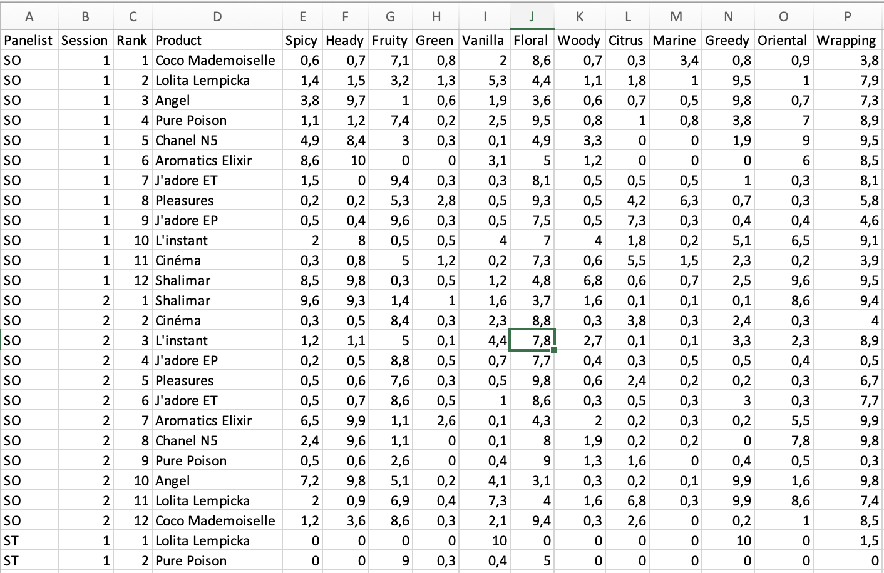
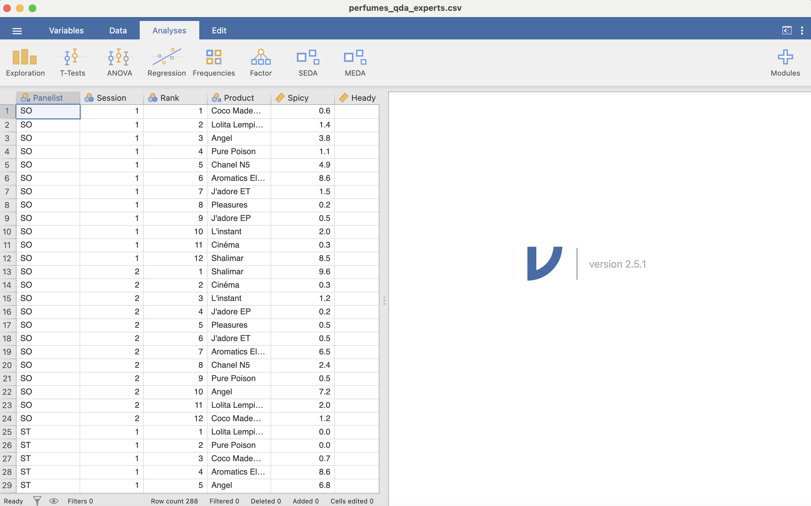
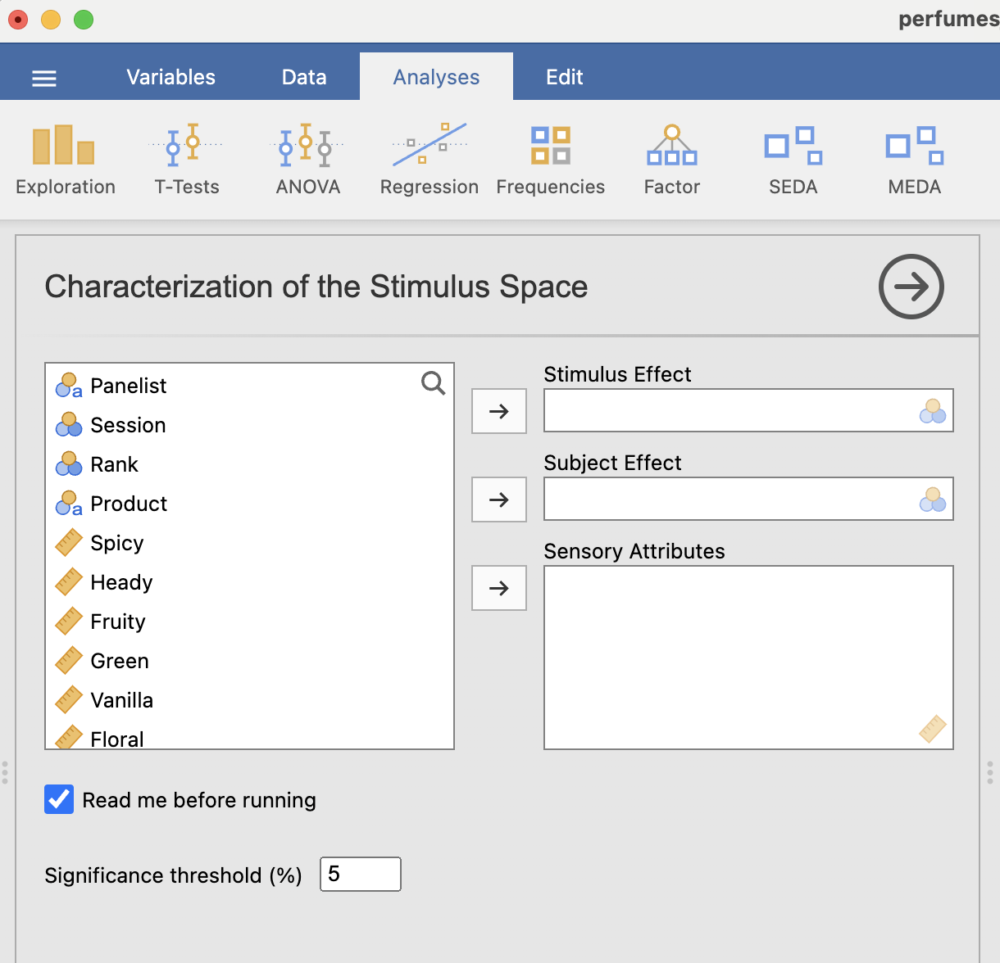
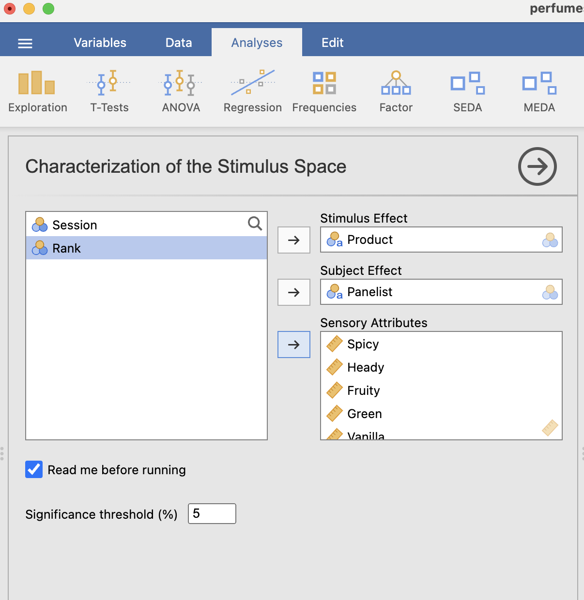
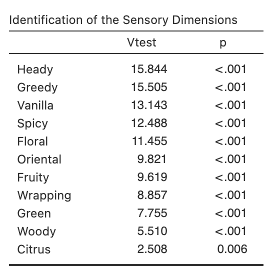
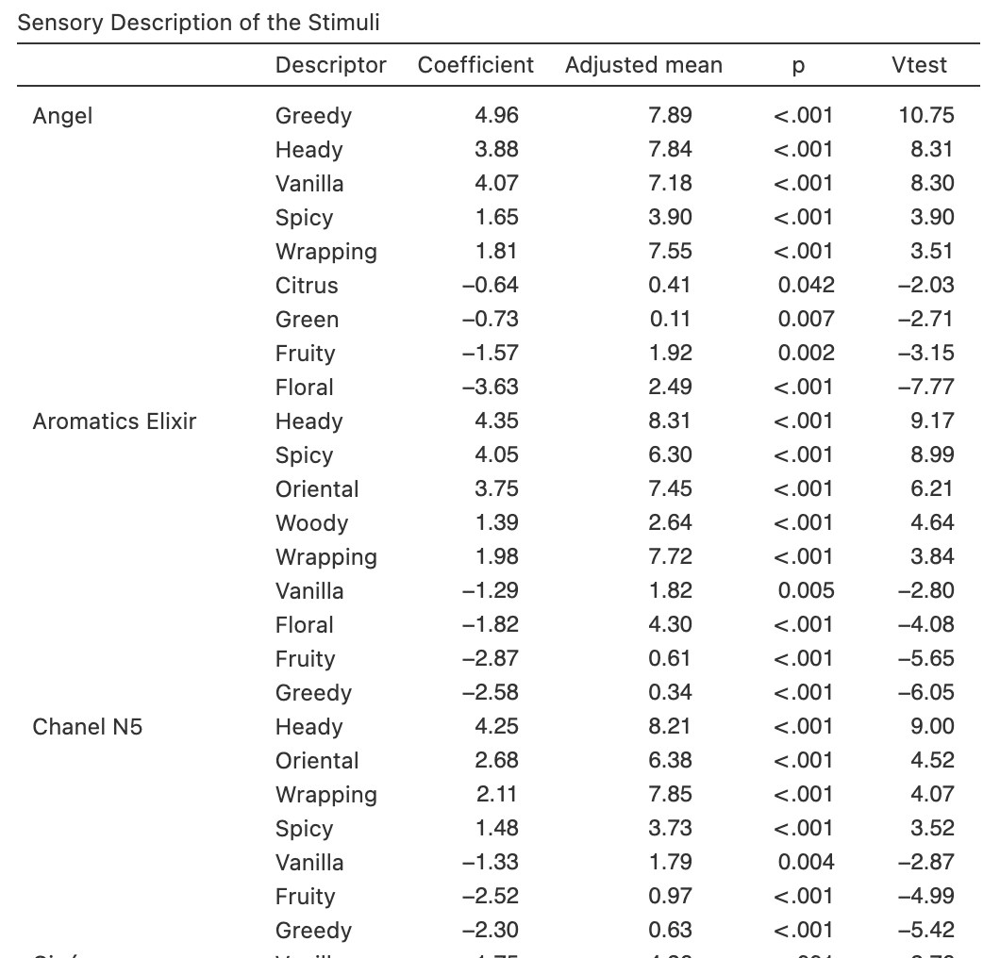

# Analyse univariée de données de type QDA (Quantitative Descriptive Analysis)

## Introduction

L'objectif de ce chapitre est de vous aider à comprendre le fonctionnement des fonctions du module *SEDA* qui permettent de caractériser un espace produits à partir de données de type QDA.

Comme jamovi s'appuie sur R en arrière-plan, nous allons montrer comment reproduire directement ces résultats dans R (pour mieux comprendre ce que fait l'interface).

## Comprendre les données de type QDA avec R et le package *SensoMineR*

Les données de type QDA se présentent de la façon suivante (*cf.* @fig-perfumes_qda_xlsx) : un premier ensemble de facteurs explicatifs de la variabilité des descripteurs sensoriels (`Panelist`, `Session`, `Rank`, `Product`), puis un ensemble de descripteurs sensoriels (à partir de `Spicy`). Ces données se trouvent dans le fichier `perfumes_qda.xlsx`.

{#fig-perfumes_qda_xlsx width="95%"}

### Importons les données

Pour importer ces données, nous utilisons la fonction `read_excel()` du *package* `readxl` : R lit le fichier Excel et enregistre le résultat dans un objet appelé `qda_data`.

```{r}
# Si non installé
# install.packages("readxl")

library(readxl)

qda_data <- read_excel(
  path = "perfumes_qda.xlsx"
)
```

Si vous souhaitez vérifier que l'importation a bien été effectuée, vous pouvez simplement afficher l'objet `qda_data` en écrivant son nom.

```{r}
qda_data
```

La première ligne de la sortie indique que `qda_data` est un *tibble*, un format de données moderne et très pratique dans de nombreuses situations. Ici, pour rester dans un format très standard (et éviter de petites surprises avec certaines fonctions de `SensoMineR`), nous convertissons l'objet en *data frame*[^01-qda_uni_corrige_v3-1].

[^01-qda_uni_corrige_v3-1]: Pour manipuler des variables catégorielles de façon plus “tidy”, vous pouvez consulter <https://forcats.tidyverse.org>. Pour les *rownames* des *tibbles*, voir <https://tibble.tidyverse.org/reference/rownames.html>.

Transformons `qda_data` en un objet de type *data frame* avec la fonction `as.data.frame()` (et ré-enregistrons le résultat dans le même objet).

```{r}
qda_data <- as.data.frame(qda_data)
```

Jetons maintenant un coup d'œil à nos données avec la fonction `summary()`.

```{r}
summary(qda_data)
```

La sortie de `summary()` indique que les variables `Panelist` et `Product` sont de classe *character* (du texte). Elle indique aussi que les autres variables du jeu de données sont de classe *numeric* : ce sont des nombres réels (on peut calculer des indicateurs statistiques de base comme le minimum, les quartiles, le maximum).

Transformons les variables `Panelist` et `Product` en facteurs, puis vérifions.

```{r}
qda_data$Panelist <- factor(qda_data$Panelist)
qda_data$Product  <- factor(qda_data$Product)

summary(qda_data)
```

Les variables `Panelist` et `Product` sont maintenant considérées comme des facteurs.

### Réalisons une analyse de variance avec la fonction `LinearModel()` du package *FactoMineR*

Dans cette section, nous cherchons à expliquer la *variabilité* de l'attribut sensoriel `Heady` à partir des variables `Product` et `Panelist`. Autrement dit : les différences de notes observées sur cet attribut proviennent-elles principalement des produits testés, des panélistes, ou des deux ?

Pour répondre à cette question, nous la reformulons sous la forme d'une hypothèse testable, ce qui nous amène à considérer un *modèle statistique* permettant de quantifier l'effet de chaque facteur. Pour commencer simplement, nous utilisons ici un modèle à deux facteurs (produit + panéliste), sans inclure `Session` ni interaction :

$$
Attribut \sim Produit + Juge
$$

Ce modèle exprime l'idée que les notes attribuées à l'attribut `Heady` dépendent d'un effet produit (certains produits étant perçus comme plus entêtants que d'autres) et d'un effet panéliste (chaque panéliste pouvant avoir une échelle de notation ou une sensibilité différente).

Nous allons donc tester ce modèle à l'aide d'une analyse de la variance (ANOVA), afin de déterminer dans quelle mesure chacun de ces facteurs contribue à la variabilité observée (celle des notes).

Pour cela, nous utilisons la fonction `LinearModel()` du package *FactoMineR* et stockons le résultat dans l'objet `res_lm`.

```{r}
# Si non installé
# install.packages("FactoMineR")

library(FactoMineR)

res_lm <- LinearModel(
  Heady ~ Product + Panelist,
  data = qda_data
)
```

L'objet `res_lm` est une liste composée de plusieurs composantes. Pour en connaître les noms, on applique la fonction `names()`.

```{r}
names(res_lm)
```

Jetons un coup d'œil à la composante qui contient les résultats globaux du modèle, notamment le *F-test* permettant d'évaluer la significativité des effets principaux.

```{r}
res_lm$Ftest
```

Les effets principaux `Product` et `Panelist` sont significatifs : cela signifie que les différences observées sur l'attribut `Heady` proviennent à la fois des produits testés et des panélistes.

Se pose maintenant une autre question : quel est le produit le plus entêtant ? Pour répondre à ce type de question, on observe les résultats au niveau des modalités (produits), en écrivant le modèle sous une forme plus explicite :

$$
Y_{ij} = \mu + \alpha_i + \beta_j + \epsilon_{ij},
$$

où $Y_{ij}$ est la note de l'attribut `Heady` donnée par le panéliste $j$ pour le produit $i$, $\mu$ est la moyenne générale, $\alpha_i$ est l'effet du produit $i$, $\beta_j$ est l'effet du panéliste $j$, et $\epsilon_{ij}$ est le résidu (c'est-à-dire ce qui n'est pas expliqué par le modèle).

Les coefficients du modèle sont estimés avec la contrainte suivante :

$$
\sum_{i=1}^{I} \alpha_i = 0,
$$

où $I$ est le nombre de produits évalués.

La caractérisation d'un produit repose sur le test de significativité du coefficient $\alpha_i$ par rapport à 0 : si $\alpha_i$ est significativement supérieur à 0, cela indique que le produit $i$ est perçu comme plus entêtant que la moyenne.

Regardons maintenant les résultats au niveau des modalités (*t-test*), autrement dit, regardons les estimations des paramètres du modèle.

```{r}
res_lm$Ttest
```

La colonne *Estimate* correspond à l'estimation des paramètres du modèle (les $\alpha_i$ et les $\beta_j$). Le produit perçu comme le plus entêtant est celui dont l'estimation est la plus élevée. Dans notre exemple, il s'agit du parfum *Aromatics Elixir*.

### Réalisons automatiquement des analyses de variance avec la fonction `decat()` du package *SensoMineR*

La fonction `decat()` est une fonction clé du package *SensoMineR*. Elle réalise une analyse de la variance pour l'ensemble des attributs sensoriels, en utilisant un modèle spécifié par l'utilisateur, puis fournit les résultats nécessaires à l'interprétation des différences entre les produits.

Il est important de placer l'effet produit en premier dans la formule du modèle, afin que les sorties soient correctement orientées vers une interprétation “produit”.

La fonction `decat()` génère des résultats numériques détaillés et deux représentations graphiques principales : la première concerne le *F-test* (effet global du produit pour chaque attribut), la seconde concerne le *t-test* (différences au niveau des produits).

```{r}
# Si non installé
# install.packages("SensoMineR")

library(SensoMineR)

res_decat <- decat(
  qda_data,
  formul   = "~Product+Panelist",
  firstvar = 5
)
```

Comme dans l'exploration d'un modèle d'ANOVA classique, nous obtenons une première figure exprimant un résultat plus “macro” (au niveau des attributs sensoriels) et une seconde exprimant un résultat plus “micro” (au niveau des produits).

Sur la première figure, les attributs sont triés de la plus significative à la moins significative selon l'effet `Product`. Dans notre exemple, `Heady` est un attribut très discriminant.

Sur la seconde figure, on visualise les principales différences entre produits : les produits et les attributs sont triés (bleu si $\alpha_i > 0$ de manière significative, rouge si $\alpha_i < 0$).

Regardons maintenant les indicateurs numériques.

```{r}
names(res_decat)
```

Le résultat principal est la description automatique de chaque produit, que l'on retrouve dans `res_decat$resT`. Cet objet est lui-même une liste.

```{r}
names(res_decat$resT)
```

Jetons un coup d'œil aux parfums *Angel* et *Coco Mademoiselle*, par exemple.

```{r}
res_decat$resT$Angel
```

Comme vous pouvez le constater, la valeur associée à `Heady` est cohérente avec celle obtenue via le premier modèle pour la modalité correspondant à *Angel*.

```{r}
res_decat$resT$`Coco Mademoiselle`
```

## Comprendre les résultats dans jamovi (module *SEDA*)

Comme expliqué précédemment, dans un premier temps, nous analysons l'espace produits dans sa globalité, puis nous nous concentrons sur chaque produit individuellement à travers des indicateurs numériques issus de l'analyse de la variance.

### Importons les données

Dans jamovi, l'analyse commence toujours par l'importation (ou l'ouverture) d'un fichier de données.

-   Si vous partez d'un export Excel, ouvrez le fichier `perfumes_qda.xlsx`.
-   Si vous partez d'un fichier jamovi, ouvrez directement un fichier `.omv` déjà préparé : il contient déjà les données **et** éventuellement les réglages d'analyse (variables choisies, options, résultats).

Dans la suite, nous supposons que vous ouvrez `perfumes_qda.xlsx` :

1.  Menu **Fichier** → **Ouvrir** (ou glisser-déposer le fichier dans la fenêtre jamovi).
2.  Vérifier que la première ligne du fichier correspond bien aux **noms de variables**.
3.  Une fois importées, les données apparaissent sous forme de tableur (Figure @fig-qda_data).

{#fig-qda_data width="75%"}

### Vérifions le type de mesure des variables

**Attention au piège des types de mesure !** C'est l'erreur la plus fréquente : si jamovi considère vos notes (0 à 10) comme des variables *nominales* (par exemple à cause d'une virgule mal placée, d'un espace, ou d'un caractère non numérique importé), le module *SEDA* peut refuser de les accepter dans le champ **Attributs** ou produire des calculs incorrects.

La check-list avant de commencer :

-   `Product` → icône **trois boules colorées** (Nominal) — ou **diagramme en bâtons** (Ordinal) selon votre codage.
-   `Panelist` → icône **trois boules colorées** (Nominal).
-   Attributs (`Spicy`, `Heady`, …) → icône **réglette** (Continu).

Si une icône n'est pas correcte :

1.  Double-cliquez sur l'en-tête de la colonne pour ouvrir l'éditeur de variable.
2.  Corrigez le **Type de mesure** (Nominal / Ordinal / Continu).
3.  Vérifiez aussi le **Type de données** (Texte, Entier, Décimal). Si une variable censée être numérique a été importée comme texte, commencez par nettoyer le fichier source (virgule vs point, espaces, caractères cachés), puis ré-importez.

> Bon réflexe : dans un jeu QDA, `Panelist` et `Product` sont catégorielles, tandis que toutes les notes d'attributs sont continues.

### Où trouver l'analyse « Caractérisation des produits » dans *SEDA* ?

Une fois les données importées et les variables correctement typées, ouvrez l'analyse :

1.  Aller dans l'onglet **Analyses**.
2.  Dans le module *SEDA*, choisir l'analyse de **caractérisation univariée** (ANOVA / *product characterization* selon la version).
3.  Renseigner :
    -   **Produit / Stimulus** : `Product`
    -   **Juge / Panelist** : `Panelist`
    -   **Attributs sensoriels** : sélectionner toutes les colonnes de notes (de `Spicy` à la dernière variable sensorielle).

Une fois l'analyse lancée, regardez le **panneau d'options** (à gauche). Le module *SEDA* propose généralement des réglages qui affinent la sortie :

-   **Threshold (seuil de significativité)** : par défaut à 0.05 (5 %). Si vous analysez un très grand nombre d'attributs, vous pouvez abaisser ce seuil (par exemple 0.01) pour ne faire ressortir que les différences très marquées.
-   **Sort by (trier par)** : permet de trier le tableau des attributs discriminants (par *p-valeur* croissante, ou par *F-value* décroissante). C'est idéal pour identifier immédiatement les descripteurs clés de votre espace produits.

Les résultats s'affichent immédiatement et se mettent à jour lorsque vous modifiez les options. À ce stade, vous avez reproduit dans jamovi la logique de la fonction `decat()` présentée plus haut : une ANOVA est réalisée pour chaque attribut, puis chaque produit est décrit à partir des effets estimés.

> Bon réflexe : enregistrez le fichier au format `.omv` dès que l'analyse est paramétrée. Vous conservez ainsi, dans un seul fichier, **données + options + résultats**, ce qui facilite énormément la reproductibilité.

## Comment le module *SEDA* caractérise-t-il un espace produits ?

### Analyses de données univariées : ANOVA

La fonction dédiée à la caractérisation de l'espace produits génère deux types de résultats : le premier concerne les attributs sensoriels dans leur ensemble, tandis que le second s'intéresse à chaque produit individuellement.

Dans jamovi, cela se traduit par une sortie très lisible, généralement organisée en deux blocs :

-   un bloc « **Attributs discriminants** » : pour chaque attribut, on teste si les produits diffèrent significativement (test global de l'effet *Produit*, analogue au *F-test* d'une ANOVA) ;
-   un bloc « **Description des produits** » : pour chaque produit, on identifie les attributs pour lesquels il est significativement **au-dessus** ou **en dessous** de la moyenne (tests au niveau des modalités, analogues aux *t-tests* sur les paramètres).

Ce découpage est exactement celui que nous avons exploré plus haut avec `LinearModel()` (résultats globaux vs résultats par modalités), puis avec `decat()` (ANOVA répétée sur l'ensemble des attributs).

Le premier résultat met en évidence les descripteurs sensoriels caractéristiques de l'espace produits : il identifie les attributs pour lesquels l'effet *Produit* est significatif, à partir du modèle d'ANOVA à deux facteurs :

$$
Attribut \sim Produit + Juge
$$

Le second résultat fournit une description individuelle de chaque produit. Cette description repose sur le même modèle, qui peut s'écrire de façon plus formelle :

$$
Y_{ij} = \mu + \alpha_i + \beta_j + \epsilon_{ij},
$$

avec la contrainte :

$$
\sum_{i=1}^{I} \alpha_i = 0,
$$

où $I$ est le nombre de produits évalués.

La caractérisation d'un produit repose sur le test de significativité du coefficient $\alpha_i$ par rapport à 0.

En pratique, pour caractériser un espace produits et chacun de ses produits, il faut renseigner l'effet *Produit*, l'effet *Juge*, ainsi que les attributs sensoriels d'intérêt (*cf.* @fig-decat_api). Par défaut, les tests de significativité se font au seuil de 5 %.

{#fig-decat_api width="60%"}

Une fois les sources de variabilité et les variables à expliquer identifiées (*cf.* @fig-decat_api_full), la fonction réalise autant d'analyses de variance qu'il y a d'attributs sensoriels. Chaque attribut est expliqué par l'effet *Produit* et l'effet *Juge*, avec un intérêt particulier porté aux résultats associés à l'effet *Produit*.

{#fig-decat_api_full width="60%" fig-pos="h"}

La fonction fournit une liste ordonnée des attributs sensoriels qui caractérisent l'espace produits, c'est-à-dire ceux pour lesquels l'effet *Produit* est significatif (*cf.* @fig-decat_result_F).

{#fig-decat_result_F width="35%"}

Pour chaque attribut, la valeur affichée dans la colonne *p* correspond à la *p-valeur* du test de l'effet *Produit*. Ce test évalue si les produits ont été perçus comme identiques ou si au moins l'un d'eux a été perçu comme différent des autres. Les attributs sont rangés par *p-valeur* croissante, du plus discriminant au moins discriminant.

**Lecture guidée des tableaux de résultats dans jamovi**

L'interface génère deux tableaux principaux qu'il faut savoir lire conjointement.

**Tableau 1 : les attributs discriminants (ANOVA globale)**\
Ce tableau liste tous les descripteurs.\
- Regardez la colonne *p* (*p-value*).\
- Si *p* \< 0.05, l'attribut permet de différencier les produits (au sens du test global de l'effet *Produit*).

Si vous avez beaucoup d'attributs, gardez en tête la question des tests multiples : dans un tutoriel, on commence souvent par une lecture simple au seuil de 5 %, puis on peut durcir le seuil (0.01) pour ne faire ressortir que les effets les plus marqués.

> Conseil pratique : les tableaux jamovi sont interactifs. Si vous avez beaucoup d'attributs, copiez le tableau (clic droit → **Copy**) et collez-le dans Excel pour filtrer/ordonner rapidement.

**Tableau 2 : la caractérisation des produits (t-tests par produit)**\
C'est le résultat le plus “métier”. Pour chaque produit, jamovi liste uniquement les attributs saillants (ceux dont le coefficient produit est significativement différent de 0).\
- **Signe du coefficient (*Estimate*)** :\
- positif → le produit est **au-dessus** de la moyenne sur l'attribut (ex. “plus sucré”) ;\
- négatif → le produit est **en dessous** de la moyenne (ex. “moins amer”).

Ce tableau vous donne directement la “carte d'identité sensorielle” de chaque produit. Par exemple, si pour *Angel* vous observez `Heady` avec une estimation positive et `Floral` avec une estimation négative, vous pouvez conclure : “*Angel* est caractérisé par un profil plus entêtant et moins floral que la moyenne des parfums étudiés.”

La fonction fournit également une description de chaque produit en fonction des attributs sensoriels qui le caractérisent : ce sont les attributs pour lesquels le test d'hypothèse $H_0 : \alpha_i = 0$ *versus* $H_1 : \alpha_i \neq 0$ conduit au rejet de $H_0$ (*cf.* @fig-decat_result_t). Pour chaque produit, la fonction affiche les attributs dont la *p-valeur* du test de significativité du coefficient $\alpha_i$ est inférieure à 0.05. Les attributs sont rangés par ordre de *p-valeur* croissante lorsque $\alpha_i > 0$, et par ordre de *p-valeur* décroissante lorsque $\alpha_i < 0$.

{#fig-decat_result_t width="60%"}

Ainsi, certains parfums se distinguent par des attributs significativement plus élevés (ou plus faibles) que la moyenne : par exemple, un parfum peut être caractérisé par des notes d'“entêtant” (`Heady`) significativement supérieures à la moyenne, tandis qu'un autre peut l'être par des valeurs significativement inférieures.

Dans le chapitre suivant, nous verrons comment ces résultats univariés alimentent une représentation multivariée : l'ACP est réalisée sur un tableau de **moyennes ajustées** par produit, ce qui permet de visualiser l'espace produits en intégrant l'ensemble des attributs (et, si besoin, d'ajouter des ellipses de confiance).
