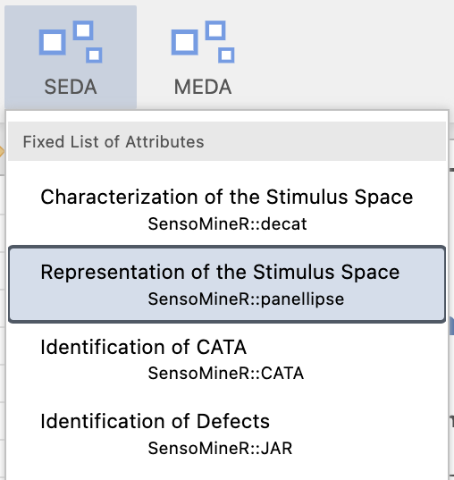
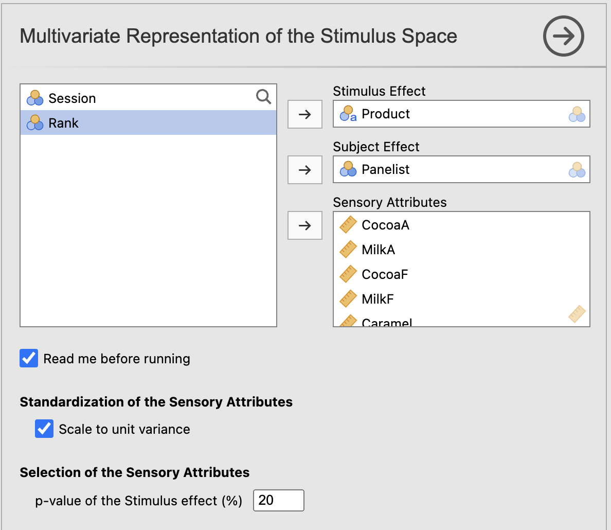
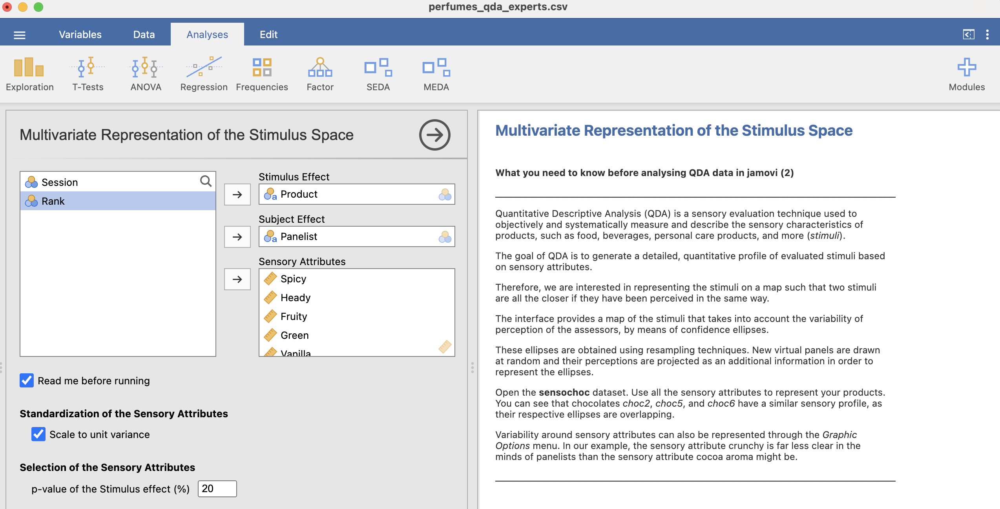
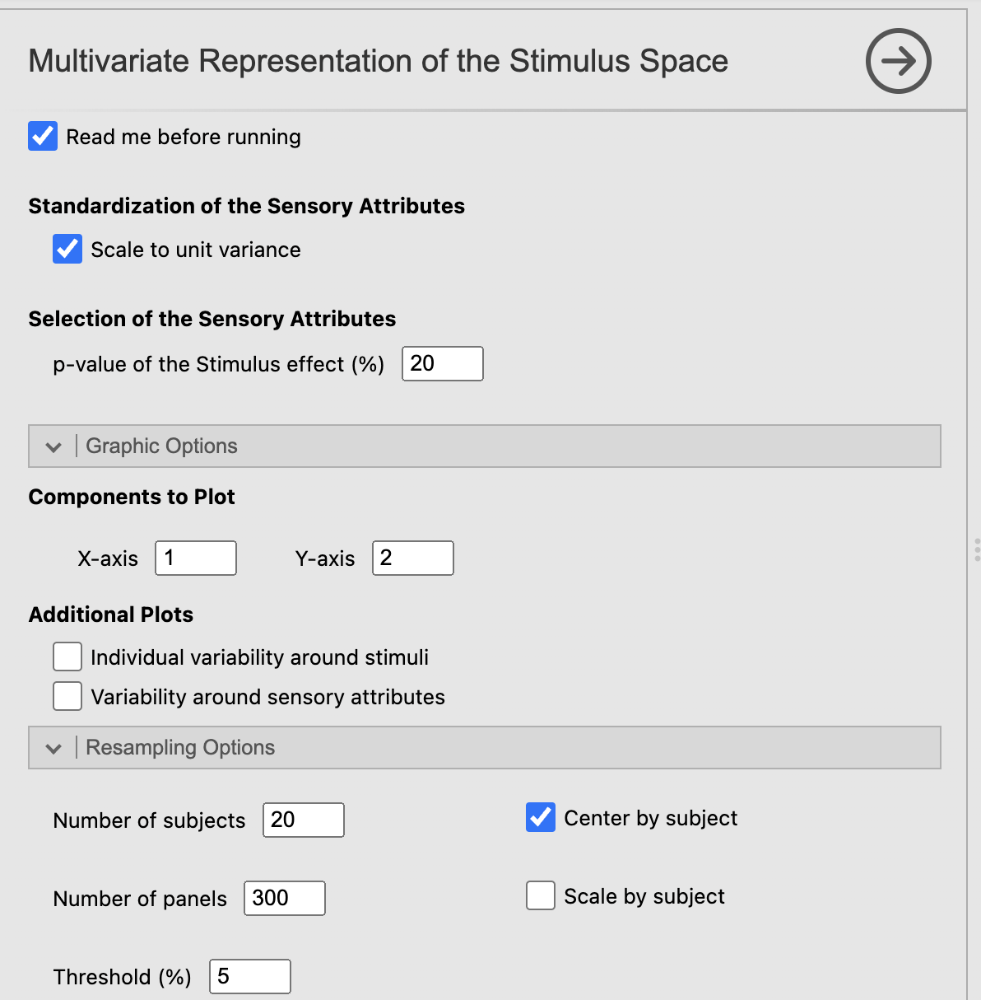

# Analyse multivariée de données de type QDA (ACP et ellipses)

## Introduction

L'objectif de ce chapitre est de comprendre ce qui se cache derrière les fonctions du module *SEDA* dédiées à la représentation multidimensionnelle d'un espace produits décrit par des données de type QDA.

Nous allons :

1.  construire le **tableau des moyennes ajustées** par produit ;
2.  réaliser une **ACP** sur ce tableau pour représenter simultanément produits et attributs sensoriels ;
3.  introduire la notion d'**information supplémentaire** et le principe des **panels virtuels** utilisés pour tracer des ellipses.

## Un peu de théorie

Dans le cadre de données QDA, chaque produit est évalué sur plusieurs attributs sensoriels par plusieurs panélistes (et parfois sur plusieurs sessions). Un modèle d'ANOVA permet d'estimer l'effet produit en tenant compte d'un effet panéliste. À partir de ce modèle, on peut calculer, pour chaque produit et chaque attribut, une **moyenne ajustée** (moyenne “corrigée” de l'effet panéliste).

Le tableau des moyennes ajustées (noté `adjmean` dans *SensoMineR*) a alors une forme simple :

-   **lignes** : produits
-   **colonnes** : attributs sensoriels
-   **cellules** : moyennes ajustées par produit et par attribut

C'est ce tableau qui sert de base à la représentation multivariée de l'espace produits : on applique une **ACP** sur `adjmean` afin d'obtenir une carte des produits (individus) et une carte des attributs (variables).

Dans la suite, nous utilisons le jeu de données des **parfums** (`perfumes_qda.xlsx`).

## Comprendre l'approche avec R

### Importons les données

Pour importer des données, nous utilisons la fonction `read_excel()` du *package* `readxl`. Ici, nous enregistrons le résultat de la lecture dans un objet appelé `qda_data`, que l'on peut ensuite afficher pour vérifier que tout s'est bien déroulé.

```{r}
# Si non installé
# install.packages("readxl")

library(readxl)

qda_data <- read_excel(
  path = "perfumes_qda.xlsx"
)

qda_data
```

Comme précédemment, `qda_data` est un *tibble*. Nous le convertissons en *data frame* pour rester dans un format très standard (et homogène avec le chapitre précédent)[^02-qda_multi_corrige_v3-1].

[^02-qda_multi_corrige_v3-1]: En réalité, on peut aussi nommer les lignes d'un *tibble*, mais c'est un peu moins pratique. Voir <https://tibble.tidyverse.org/reference/rownames.html>.

```{r}
qda_data <- as.data.frame(qda_data)
```

Jetons maintenant un œil à nos données, puis transformons `Panelist` et `Product` en facteurs[^02-qda_multi_corrige_v3-2].

[^02-qda_multi_corrige_v3-2]: N'hésitez pas à consulter <https://forcats.tidyverse.org>.

```{r}
summary(qda_data)

qda_data$Panelist <- factor(qda_data$Panelist)
qda_data$Product  <- factor(qda_data$Product)

summary(qda_data)
```

### Construisons le tableau des moyennes ajustées (par produit)

Le tableau `adjmean` est produit par la fonction `decat()` du package *SensoMineR*. Nous lui indiquons :

-   la formule du modèle (`~Product+Panelist`) : effet produit + effet panéliste ;
-   la position de la première variable sensorielle (`firstvar = 5`) ;
-   `graph = FALSE` : pas de graphiques automatiques ici.

```{r}
# Si non installé
# install.packages("SensoMineR")

library(SensoMineR)

res_decat <- decat(
  qda_data,
  formul   = "~Product+Panelist",
  firstvar = 5,
  graph    = FALSE
)
```

Jetons un œil au tableau des moyennes ajustées :

```{r}
res_decat$adjmean
```

### Réalisons une ACP sur la table des moyennes ajustées

Nous appliquons maintenant une **ACP** sur `adjmean`. Cette ACP fournit :

-   une représentation des **produits** (individus) ;
-   une représentation des **attributs** (variables).

```{r}
# Si non installé
# install.packages("FactoMineR")

library(FactoMineR)

res_pca <- PCA(res_decat$adjmean, graph = FALSE)
```

```{r}
#| fig-cap: "Représentation des parfums (ACP sur les moyennes ajustées)"
plot.PCA(res_pca, choix = "ind")
```

```{r}
#| fig-cap: "Représentation des attributs sensoriels (ACP sur les moyennes ajustées)"
plot.PCA(res_pca, choix = "var")
```

### Illustrons la notion d'information supplémentaire

En ACP, on distingue :

-   les **individus actifs** (ceux qui servent à construire les axes) ;
-   les **individus supplémentaires** (projetés *a posteriori*, sans modifier les axes) ;
-   les **variables supplémentaires** (elles aussi projetées *a posteriori*).

Dit simplement, nous allons créer un “panel virtuel” en ré-échantillonnant des **panélistes** avec remise (bootstrap). C'est une version simplifiée du principe utilisé pour générer des ellipses autour des produits : on simule plusieurs panels, on recalcule des tableaux de moyennes ajustées, puis on projette ces produits “virtuels” en **individus supplémentaires** sur l'ACP du tableau initial.

```{r}
set.seed(123)

# Ré-échantillonnage avec remise au niveau des panélistes (blocs)
panel_levels <- levels(qda_data$Panelist)
boot_panels  <- sample(panel_levels, length(panel_levels), replace = TRUE)

qda_data_boot <- do.call(
  rbind,
  lapply(boot_panels, function(p) qda_data[qda_data$Panelist == p, ])
)

qda_data_boot$Panelist <- factor(qda_data_boot$Panelist)
qda_data_boot$Product  <- factor(qda_data_boot$Product)
```

On applique la même procédure : calcul des moyennes ajustées avec les produits en ligne.

```{r}
res_decat_boot <- decat(
  qda_data_boot,
  formul   = "~Product+Panelist",
  firstvar = 5,
  graph    = FALSE
)

res_decat_boot$adjmean
```

#### Individus supplémentaires : projeter les produits “virtuels” sur l'ACP

On combine la table initiale et la table “bootstrap” en empilant les lignes. On obtient donc deux fois la liste des produits : les premiers (actifs) et les seconds (supplémentaires).

```{r}
adjmean_illu <- rbind(res_decat$adjmean, res_decat_boot$adjmean)

n_prod <- nrow(res_decat$adjmean)

res_pca_ind_sup <- PCA(
  adjmean_illu,
  ind.sup = (n_prod + 1):(2 * n_prod),
  graph   = FALSE
)
```

```{r}
#| fig-cap: "Produits actifs et produits supplémentaires (panel virtuel)"
plot.PCA(res_pca_ind_sup, choix = "ind")
```

Dans ce graphique, les produits supplémentaires sont projetés sur les mêmes axes que les produits actifs : ils **n'interviennent pas dans le calcul** des axes, mais permettent de visualiser la variabilité liée au panel.

#### Variables supplémentaires : illustrer l'ajout de variables sans changer les axes

On peut aussi illustrer l'ajout de variables supplémentaires en concaténant des colonnes. Pour éviter des noms de colonnes dupliqués, on renomme les variables “bootstrap”.

```{r}
boot_adj <- res_decat_boot$adjmean
colnames(boot_adj) <- paste0(colnames(boot_adj), "_boot")

adjmean_illu_var <- cbind(res_decat$adjmean, boot_adj)

p <- ncol(res_decat$adjmean)

res_pca_var_sup <- PCA(
  adjmean_illu_var,
  quanti.sup = (p + 1):ncol(adjmean_illu_var),
  graph      = FALSE
)
```

```{r}
#| fig-cap: "Variables actives et variables supplémentaires"
plot.PCA(res_pca_var_sup, choix = "var")
```

Comme vous le voyez, l'ajout d'informations supplémentaires ne change pas les résultats principaux de l'ACP : les axes sont construits uniquement à partir des données actives, et les informations supplémentaires sont projetées ensuite.

### La fonction `panellipse()` du package *SensoMineR*

Ce que nous venons de décrire peut être réalisé plus simplement avec la fonction `panellipse()` du package *SensoMineR*. Elle automatise la génération de panels virtuels et permet d'obtenir des représentations avec ellipses (selon les options choisies), en lui indiquant où se trouvent les variables `Product` et `Panelist`.

```{r}
res_ellipse <- panellipse(
  qda_data,
  col.p    = 4,  # colonne Product (à adapter si l'ordre change)
  col.j    = 1,  # colonne Panelist (à adapter si l'ordre change)
  firstvar = 5
)
```

> Remarque : `col.p` et `col.j` dépendent de la position des colonnes dans votre fichier. Ici, on suppose que `Panelist` est en colonne 1 et `Product` en colonne 4, comme dans la structure présentée plus haut.

## Comprendre les résultats dans jamovi (module *SEDA*)

### Pourquoi ne pas utiliser l'ACP “standard” de jamovi ?

Vous pourriez être tenté d'aller dans le menu **Factor → Principal Component Analysis** pour réaliser une ACP “classique”. Attention : appliquée directement aux données brutes, cette ACP mélange l'effet **Produit** et l'effet **Panéliste** (les différences de niveau de notation entre juges), ce qui peut déformer la cartographie de l'espace produits.

Le module *SEDA* fait le travail de “nettoyage” nécessaire à une cartographie produit :

1.  il ajuste une ANOVA pour isoler l'effet *Produit* en tenant compte de l'effet *Panéliste* ;
2.  il calcule les **moyennes ajustées** par produit ;
3.  il lance l'ACP sur ce tableau “propre”.

C'est pourquoi, pour une représentation sensorielle des produits à partir de données QDA, il est préférable de passer par *SEDA* plutôt que par l'ACP standard.

Les résultats clés que nous venons de générer dans R sont exactement ceux qui sont intégrés dans **jamovi** via le module *SEDA* :

1.  **ACP sur le tableau des moyennes ajustées** (produits × attributs) ;
2.  **Projection de produits issus de panels virtuels** afin de visualiser la variabilité et de tracer des ellipses autour des produits.

Les données QDA ont la structure suivante (*cf.* @fig-qda_data) : un premier ensemble de facteurs explicatifs (par exemple `Panelist`, `Session`, `Rank`, `Product`), puis un ensemble de descripteurs sensoriels (à partir du premier attribut sensoriel).

> Dans ce livre, la structure des données QDA est déjà illustrée à la figure @fig-qda_data (chapitre précédent). Ici, nous nous concentrons sur la **lecture des sorties** de l'ACP (produits, attributs, ellipses) et sur les **paramètres** à régler dans jamovi.

### Préparer les données dans jamovi

Avant de lancer l'analyse, prenez 30 secondes pour vérifier que jamovi a bien reconnu les types de variables :

-   `Product` doit être une variable **catégorielle** (nominale) : ce sont les *produits*.
-   `Panelist` doit être une variable **catégorielle** : ce sont les *juges/panélistes*.
-   Les attributs sensoriels (`Spicy`, `Heady`, …) doivent être **numériques** (échelle continue).
-   Si vous avez une variable `Session`, vous pouvez la conserver dans la feuille de données, mais elle n'est pas utilisée dans l'analyse présentée ici (on reproduit le modèle simple du chapitre précédent).

Dans jamovi, ces réglages se font dans l'onglet **Données** (type de variable, libellés, niveaux, etc.). Un mauvais type (par exemple un attribut lu comme texte) empêche souvent l'analyse de démarrer ou produit des résultats incohérents.

### Analyses de données multivariées : ACP

La fonction dédiée à la visualisation de l'espace produits (*cf.* @fig-menu_ellipse) génère deux types de résultats :

-   une ACP réalisée sur le **tableau des moyennes ajustées**, calculé à partir des analyses de variance ;
-   des **panels virtuels** générés par tirages aléatoires avec remise (bootstrap), permettant de projeter des produits supplémentaires et de construire des ellipses autour des produits.

{#fig-menu_ellipse width="35%"}

#### 1) Renseigner les variables : produit, juge et attributs

L'écran de paramétrage de l'analyse reprend la logique de `decat()` :

-   **Produit** : `Product`\
-   **Juge** : `Panelist`\
-   **Attributs** : sélectionnez la plage des descripteurs sensoriels (dans notre fichier, à partir de `Spicy`)

{#fig-decat_api_pca width="50%"}

En pratique, la sélection des attributs sensoriels se fait très vite : cliquez sur le premier attribut, puis *Shift + clic* sur le dernier pour sélectionner tout le bloc.

#### 2) Choisir quels attributs entrent réellement dans l'ACP

Le tableau des moyennes ajustées contient un score (ajusté) par produit et par attribut. *SEDA* vous propose ensuite un réglage particulièrement utile : **Filter by threshold** (filtrer par seuil). L'idée est simple : ne conserver (ou n'afficher) que les attributs **réellement discriminants** au sens du test *F* de l'ANOVA.

C'est une fonctionnalité majeure et très pédagogique, car vous avez souvent deux stratégies :

-   **ACP exploratoire (seuil = 1.00)** : vous affichez *tous* les attributs, même ceux qui ne différencient pas les produits.
    -   Avantage : vue exhaustive.\
    -   Inconvénient : carte souvent illisible, avec beaucoup de flèches courtes près du centre (attributs peu informatifs).
-   **ACP épurée (seuil = 0.05)** : jamovi masque automatiquement les attributs non significatifs (ceux qui échouent au test *F*).
    -   Avantage : carte beaucoup plus lisible, centrée sur ce qui structure réellement les différences entre produits.

{#fig-decat_api_pca_2 width="50%"}

**Conseil** : commencez avec un seuil à 0.05. Si la carte est trop “vide”, remontez à 0.10 ou 0.20. Si elle est trop chargée, descendez à 0.01. L'interactivité de jamovi permet de tester ces réglages en temps réel, sans relancer toute l'analyse.

#### 3) Données réduites ou non réduites ?

Par défaut, *SEDA* réalise l'ACP sur des données **réduites** (standardisées), ce qui revient à donner le même poids à chaque attribut (on travaille sur des corrélations plutôt que sur des variances brutes).

-   C'est souvent un bon choix quand les attributs n'ont pas exactement la même dispersion (même s'ils sont notés sur la même échelle).
-   Si vos attributs ont des variances naturellement très différentes *et* que vous souhaitez conserver cette information (plus rare en QDA), vous pouvez désactiver la réduction.

L'important est de comprendre l'effet : *réduire* évite qu'un attribut “très variable” domine mécaniquement les axes.

#### 4) Options graphiques (lisibilité)

Enfin, l'analyse propose des options de rendu (étiquettes, tailles, éléments affichés, etc.). Ces réglages n'ont aucun impact sur les calculs, mais ils sont essentiels pour produire des figures lisibles dans un rapport.

{#fig-decat_api_pca_option width="50%"}

### Lire les sorties : produits, attributs et ellipses

Une fois l'analyse lancée, jamovi affiche généralement plusieurs blocs de résultats. L'idée est toujours la même : *comprendre ce que raconte le plan factoriel*.

#### Carte des produits (individus)

Chaque point correspond à un produit (un parfum, ici). Deux produits proches sur la carte ont des profils sensoriels (moyennes ajustées) proches sur l'ensemble des attributs retenus.

Quelques règles de lecture utiles :

-   Les pourcentages indiqués sur les axes (Dim 1, Dim 2) correspondent à la part d'information (inertie) expliquée par chaque dimension.
-   Les produits situés près de l'origine sont “moyens” sur les attributs qui structurent l'axe ; ce sont souvent les produits extrêmes (loin de l'origine) qui donnent l'interprétation la plus nette.
-   Pour interpréter *pourquoi* un produit est à droite plutôt qu'à gauche, on combine cette carte avec la carte des attributs (voir ci-dessous).

#### Carte des attributs (variables)

Sur la carte des variables, chaque attribut est représenté par un vecteur (ou une flèche). On peut lire :

-   la **direction** : elle indique vers quels produits l'attribut “tire” la structure ;
-   la **longueur** : plus un attribut est long, plus il est bien représenté sur le plan (fortement corrélé aux axes) ;
-   l'**angle** entre deux attributs : petit angle = corrélation positive, angle proche de 180° = corrélation négative, angle proche de 90° = quasi-indépendance (à ce niveau de représentation).

C'est cette carte qui permet de donner un sens “sensoriel” aux axes : par exemple, si `Heady` et `Oriental` pointent dans la même direction, l'axe oppose souvent des produits “plus entêtants/orientaux” à des produits qui le sont moins (au moins sur les attributs retenus).

#### Ellipses : variabilité liée au panel

Lorsque vous activez l'option **ellipses**, jamovi génère des *panels virtuels* par bootstrap :

1.  on ré-échantillonne les panélistes (avec remise) ;
2.  on recalcule un tableau de moyennes ajustées ;
3.  on projette ces produits “virtuels” sur l'ACP du panel initial ;
4.  on résume la dispersion par une ellipse autour de chaque produit.

> Note sur la performance : lorsque vous cochez la case **Ellipses**, jamovi lance une procédure de *bootstrap* (ré-échantillonnage) et simule des centaines de jurys virtuels. Ne soyez pas surpris si l'affichage met quelques secondes à se rafraîchir. Pendant ce calcul, évitez de changer d'autres options (couleurs, titres, etc.) pour ne pas relancer la procédure inutilement.

L'interprétation est simple :

-   **ellipse petite** : la position du produit est stable d'un panel à l'autre (résultat robuste) ;
-   **ellipse grande** : la position varie davantage (incertitude plus forte liée au panel) ;
-   **fort recouvrement** entre ellipses : prudence pour conclure à une différence nette entre produits sur ce plan ;
-   **ellipses bien séparées** : différences plus “solides” sur les deux dimensions représentées.

> Attention : ces ellipses décrivent la variabilité *du point moyen* (moyennes ajustées) due au ré-échantillonnage des juges. Elles ne représentent pas directement la dispersion des notes individuelles.

### Exporter et réutiliser les résultats

Comme dans les chapitres précédents, l'intérêt de jamovi est aussi de rendre les sorties facilement réutilisables :

-   **Table des moyennes ajustées** : utile pour conserver une “table produits × attributs” propre.
-   **Coordonnées des produits** (Dim 1, Dim 2, …) : à exporter si vous voulez, par exemple, faire un clustering sur l'espace sensoriel.
-   **Contributions / cos²** : très utiles pour savoir quels produits/attributs structurent réellement les axes et lesquels sont mal représentés.

**Produire des graphiques “prêts à publier”**

Les graphiques jamovi sont directement ajustables. Avant d'exporter votre carte ACP pour un rapport :

-   Redimensionnez le graphique dans la fenêtre de résultats (en tirant un coin) pour aérer les étiquettes si elles se chevauchent.
-   Dans le panneau d'options, augmentez la taille des labels (*Label size*) si vous visez une projection (diaporama) ou une figure imprimée.
-   Faites un clic droit sur le graphique → **Image → Export…** :
    -   privilégiez **PDF** ou **EPS** pour une qualité vectorielle (idéal pour LaTeX/Quarto et l'édition) ;\
    -   utilisez **PNG** pour une insertion rapide dans un document.

Dans jamovi, vous pouvez généralement copier une table (clic droit → *Copier*) ou exporter les résultats (selon votre flux de travail) pour les intégrer à un rapport.

------------------------------------------------------------------------

Dans la suite du livre, nous utiliserons ces cartes pour interpréter la structure globale de l'espace produits, puis nous montrerons comment aller plus loin (par exemple en combinant représentation et classification) selon vos objectifs d'analyse.
