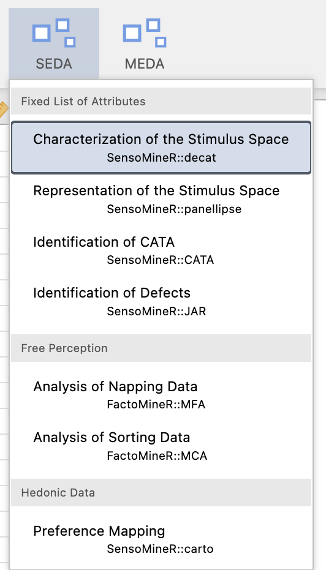

---
title: "Analyse univariée de données QDA"
format: html
---

# Analyse univariée de données de type QDA (Quantitative Descriptive Analysis)

L'objectif de cette partie est de vous aider à comprendre ce qui se cache derrière les fonctions du module *SEDA* dédiées à la caractérisation d'un espace produits décrit par des données de type QDA.

## Un peu de théorie

Comme *jamovi* est une interface graphique basée sur R, toutes les analyses sont effectuées avec R. Nous allons donc vous montrer comment les différents résultats sont obtenus directement dans R.

Prenons l’exemple du parfum analysé dans le fichier *jamovi* `qda_univariate_description.omv`.

### Importons les données

```{r}
# Si non installé
# install.packages("readxl")
library(readxl)

qda_data <- read_excel("perfumes_qda.xlsx")
qda_data
```

`qda_data` est un *tibble*, format pratique mais nous préférons le transformer en *data frame*[^01-qda_uni-1].

[^01-qda_uni-1]: On peut aussi nommer les lignes d’un tibble, mais c’est moins pratique : <https://tibble.tidyverse.org/reference/rownames.html>

```{r}
qda_data <- as.data.frame(qda_data)
summary(qda_data)
qda_data$Panelist <- as.factor(qda_data$Panelist)
qda_data$Product <- as.factor(qda_data$Product)
summary(qda_data)
```

[^01-qda_uni-2]: Pour en savoir plus : <https://forcats.tidyverse.org>

### Analyse de variance avec `LinearModel()` (`FactoMineR`)

On cherche à expliquer l’attribut `Heady` par `Product` et `Panelist`.

```{r}
# install.packages("FactoMineR")
library(FactoMineR)

res_lm <- LinearModel(Heady ~ Product + Panelist, data = qda_data)
names(res_lm)
res_lm$Ftest
res_lm$Ttest
```

La colonne *Estimate* donne l’estimation des effets $lpha_i$. Le produit avec la plus forte valeur est le plus capiteux.

### Analyse automatique avec `decat()` (`SensoMineR`)

La fonction `decat()` applique une ANOVA à tous les attributs. Elle est utilisée dans *jamovi*.

```{r}
# install.packages("SensoMineR")
library(SensoMineR)

res_decat <- decat(qda_data,
                   formul = "~Product+Panelist",
                   firstvar = 5)
```

```{r}
names(res_decat)
names(res_decat$resT)
res_decat$resT$Angel
res_decat$resT$`Coco Mademoiselle`
```

## Du côté de *jamovi* et du module *SEDA*

Les données QDA incluent des facteurs explicatifs et des descripteurs sensoriels à partir d'une liste définie *a priori*.

{#fig-qda_data width="75%"}

Le module *SEDA* permet d’analyser les produits globalement puis individuellement.

{#fig-menu_decat width="35%"}

### Caractérisation via ANOVA

On utilise le modèle :

$$
Y_{ij} = \mu + \alpha_i + \beta_j + \varepsilon_{ij}
$$

avec la contrainte :

$$
\sum_i \alpha_i = 0
$$

{#fig-decat_api width="60%"}

{#fig-decat_api_full width="60%"}

La sortie classe les attributs selon la significativité de l’effet *Produit* :

{#fig-decat_result_F width="35%"}

Elle décrit chaque produit via les attributs pour lesquels $lpha_i$ est significatif :

{#fig-decat_result_t width="60%"}

Ainsi, le chocolat 1 est particulièrement amer et peu sucré.
